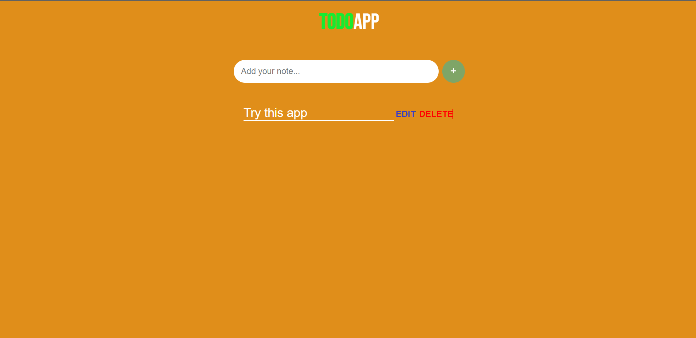

# TODO APP
 ### I have made a Simple TODO app by the help of HTML, CSS, and JavaScript.

## Technology Used:-
  - ` HTML ` 
  - ` CSS ` 
  - ` JS ` 

### Also The Web page has a theme Changer , So you can see the content in light mode as well as daek mode.

 

 
 

Live Link:- [Click here!](https://amarjeet-todo-app.netlify.app/)

Picture of my project:-

### Time Taken For This Project:- 2 hours.